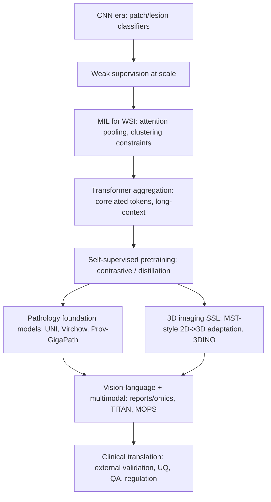

# State of the art in image-based classification for histology and MRI, CT, PET, and SPECT

## Executive summary

Image-based classification for diagnostics and prognostics in histology and cross-sectional imaging is now dominated by a small set of architectural ideas: (i) large pretrained encoders (often vision transformers) learned with self-supervision, (ii) weak supervision to exploit slide-level or study-level labels, and (iii) aggregation schemes that cope with “many instances per label” (multiple-instance learning in histology; slice/volume tokenization and temporal modeling in radiology). In digital pathology, open-access “foundation models” have rapidly become the default starting point for slide-level classification and survival prediction, especially via feature-extractor + MIL pipelines and, increasingly, whole-slide or multimodal (vision–language) pretraining. citeturn11view0turn20search0turn20search27turn13search11

In histology (whole-slide images, WSIs), the clearest state-of-the-art trend is scaling: larger and more diverse pretraining (tiles, slides, and institutions) plus architectures that can model long context across many tiles. For example, Prov-GigaPath reports pretraining on 1.3B tiles from 171,189 WSIs and emphasizes whole-slide long-context modeling as a key differentiator, while achieving state-of-the-art results on nearly all tasks in its benchmark suite. citeturn11view0turn12view0 In parallel, “clinical-grade” large models such as Virchow and UNI show strong performance on pan-cancer detection and multi-class tissue classification, including rare cancers, and multimodal models (TITAN) report improvements on survival prediction and retrieval using vision–language signals from pathology reports. citeturn20search13turn20search0turn20search27turn12view3

In MRI/CT/PET/SPECT, data scarcity and heterogeneity remain the binding constraints, but a similar “foundation-first” pattern is emerging: adapt 2D self-supervised encoders to 3D tasks (e.g., MST) and pretrain general-purpose 3D encoders with self-distillation (3DINO). MST reports consistent AUC improvements over a 3D ResNet baseline across breast MRI, chest CT, and knee MRI, coupled with improved saliency map quality. citeturn23search0 3DINO reports pretraining of a ViT on ~100,000 unlabeled 3D volumes and shows stronger downstream classification AUC than multiple baselines on tasks such as COVID-CT-MD and ICBM age classification, including low-label regimes. citeturn24view0turn24view3

For preclinical projects, the strongest actionable takeaway is methodological rather than purely architectural: the most reliable performance gains come from (a) in-domain self-supervised pretraining or strong foundation models, (b) validation designed for domain shift (site/instrument/strain/batch separation, truly external cohorts), and (c) calibrated uncertainty + interpretable outputs to support screening/triage workflows rather than “black-box” replacement. The murine congenital heart defect (CHD) µCT work is a representative preclinical example: it reports high internal AUC, then explicitly stress-tests on later “prospective” and “divergent” cohorts, showing how performance can degrade under biological/technical novelty and how fine-tuning recovers AUC. citeturn22view7

## Method evolution and core architectures

The field’s evolution is best understood as a sequence of responses to three constraints: (1) limited expert labels, (2) extremely large images (WSIs, 3D volumes), and (3) domain shift across scanners, sites, staining protocols, and preclinical vs clinical acquisition. citeturn11view0turn24view0turn21view3

image_group{"layout":"carousel","aspect_ratio":"16:9","query":["whole slide histopathology image tiles","MRI brain scan axial slices","chest CT scan axial view","FDG PET-CT fused image example","DaTscan SPECT brain image example"],"num_per_query":1}

### CNNs to transformers

CNNs remain strong baselines, especially when labels are abundant and task-local (e.g., lesion-level), but transformers increasingly dominate when long-range context, multi-scale structure, or transfer learning is central. In pathology, transformers are used either as patch/tile encoders (often pretrained by self-supervision) or as aggregators across many instances. In radiology, transformers often appear as slice/patch token mixers layered on top of 2D encoders or as end-to-end 3D ViTs in foundation-model form. citeturn23search0turn24view3turn11view0

### Self-supervised learning and foundation models

Self-supervised learning (SSL) addresses the label bottleneck by learning representations from massive unlabeled corpora. In pathology, multiple open-access foundation models are trained via DINO-style distillation, contrastive objectives, or vision–language alignment using reports/captions; the downstream “slide classifier” is often a lightweight linear probe or MIL head. citeturn20search0turn11view0turn13search11turn13search18 In 3D imaging, 3DINO adapts DINOv2-style self-distillation to volumes, reporting pretraining on ~100,000 3D scans and improved classification AUC over multiple baselines, even when only a small fraction of labels are available for fine-tuning. citeturn24view0turn24view3

### Weak supervision and multiple-instance learning

Weak supervision is not optional for many diagnostic/prognostic endpoints because obtaining dense annotations is expensive and sometimes ill-defined. WSIs are the canonical MIL setting: a slide (bag) contains thousands of tiles (instances), but only some regions are diagnostic; attention-based MIL provides a permutation-invariant aggregator and is often used as an “explainability by design” mechanism via attention maps. citeturn19search3turn3search0turn11view0turn20search0 Benchmarking work underscores that feature extractor choice dominates downstream stability and that some traditional preprocessing (e.g., stain normalization) may become less necessary when robust SSL encoders are used. citeturn7search1turn7search29

### Multimodal modeling

Multimodal models increasingly combine images with text (reports) and/or omics and clinical variables. In pathology, TITAN uses vision–language alignment with pathology reports and synthetic captions and reports improvements across clinical tasks including survival prediction (via concordance index gains over strong baselines). citeturn20search27turn13search2turn13search6 In PET-CT prognostication, MOPS integrates FDG PET-CT with report-derived features (“repomics”) and clinical data, reporting higher C-index and time-dependent AUC than single-modality models, but also noting the need for external multi-center validation. citeturn21view4turn22view3turn22view6

### Mermaid flowchart of method evolution

## Evidence base from open-access primary studies

The tables below prioritize open-access primary sources (open-access journals and preprints). When a detail is not stated clearly in the paper or accessible text, it is marked “Not specified.”

### Major studies in histology and computational pathology

| Study (open-access) | Modality | Task type | Dataset size | Model / approach | Performance reported | Validation type | Code / weights | Key limitations noted |
|---|---|---|---|---|---|---|---|---|
| A whole-slide foundation model for digital pathology from real-world data (Prov-GigaPath, 2024) citeturn11view0turn12view0 | Histology WSI (H&E + IHC) | Diagnostic (subtyping) and biomarker-like “pathomics” classification | Pretrain: 1,384,860,229 tiles from 171,189 WSIs, >30,000 patients, 31 tissue types; benchmark includes Providence + TCGA tasks citeturn11view0 | Long-context ViT (“GigaPath”) with LongNet adaptation + DINOv2 tile pretraining citeturn11view0 | State-of-the-art on 25/26 tasks; significant improvement over second-best on 18 tasks (task-specific metrics in paper; not all enumerated in accessible excerpt) citeturn11view0 | Internal benchmarks spanning multiple tasks; includes evaluation on TCGA tasks citeturn11view0 | Reported as open-weight; code/weights link not specified in excerpts citeturn11view0 | Reliance on large real-world health system data; downstream performance depends on domain match and label definitions; full generalization requires external multi-institution testing beyond benchmark composition citeturn11view0 |
| Towards a general-purpose foundation model for computational pathology (UNI, 2024) citeturn20search0turn20search5 | Histology WSI | Diagnostic (tissue/cancer classification), plus diverse clinical endpoints | Evaluated across 34 tasks; includes 32-class pan-cancer tissue classification with rare cancers citeturn20search0 | DINOv2-style SSL foundation model used for linear probing / efficient adaptation citeturn20search0 | 32-class tissue: balanced accuracy 65.7%, AUROC 0.975; outperforms REMEDIS by +4.7% balanced accuracy and +0.017 AUROC citeturn20search0 | Multi-task evaluation; task-specific splits vary by benchmark (details in paper) citeturn20search0 | GitHub + model downloads listed citeturn20search5 | Performance varies by task; downstream clinical validation and deployment workflows not guaranteed by benchmark success; potential IP constraints noted in related communications (provisional patents) citeturn20search0turn20search26 |
| A foundation model for clinical-grade computational pathology and rare cancers detection (Virchow, 2024) citeturn20search13turn12view2 | Histology WSI (H&E) | Diagnostic (pan-cancer detection; rare cancer variants) | Pretrained on ~1.5M WSIs (paper), diverse tissue/specimen types citeturn13search8turn20search13 | Large ViT foundation model + embeddings used for specimen-level detection citeturn20search13 | Pan-cancer detection AUROC ~0.95 across 9 common + 7 rare; rare cancers AUROC 0.937 citeturn20search13turn13search8 | Includes common and rare subgroups; details depend on task design; external generalization is the central aim citeturn20search13 | Weights/code availability not specified in excerpts; related Virchow2 preprint exists citeturn20search13turn13search1 | Cancer-type performance non-uniform (some rare cancers <0.9 AUROC) and requires careful clinical definition of “positive” cases; deployment needs robust QA and workflow integration citeturn13search0turn20search13 |
| A visual-language foundation model for computational pathology (CONCH, 2024) citeturn13search11turn13search3 | Histology images + text | Diagnostic and retrieval/classification across tasks | Pretrained on >1.17M image–caption pairs (plus image/text sources) citeturn13search11turn13search3 | Vision–language contrastive pretraining for pathology (image–text alignment) citeturn13search11 | Reported state-of-the-art across multiple pathology tasks (task-level metrics vary; not all reproduced here) citeturn13search11 | Task-specific evaluations; supports zero-/few-shot settings via language supervision citeturn13search11 | GitHub available citeturn13search3 | Performance depends on caption/report quality and domain match; interpretability requires care (language alignment does not ensure causal relevance) citeturn13search11 |
| A multimodal whole-slide foundation model for pathology (TITAN, 2025) citeturn20search27turn13search6 | WSI + pathology reports | Diagnostic and prognostic (including survival prediction) | Pretrained on 335,645 WSIs; uses pathology reports + synthetic captions citeturn20search27turn13search18 | Vision SSL + vision–language alignment; produces slide embeddings and report generation citeturn20search27 | Survival tasks: TITAN/TITAN-V outperform next-best baseline (e.g., +3.62% C-index vs CHIEF on reported comparisons) citeturn13search2 | Broad task suite (linear probing, few-shot, zero-shot, retrieval); evaluation details by task citeturn12view3turn20search27 | GitHub available citeturn13search6 | Text modality introduces privacy/governance constraints; clinical adoption depends on how report generation and retrieval fit pathology workflows citeturn20search27 |
| Benchmarking foundation models as feature extractors for weakly supervised computational pathology (2024) citeturn7search12 | Histology WSI | Diagnostic and prognostic tasks across cancers | 13 cohorts; 6,818 patients; 9,528 slides; 19 foundation models citeturn7search12 | Comparative benchmarking across models (vision-only and vision–language), including ensembles citeturn7search12 | CONCH top overall, with complementary models; CONCH+Virchow2 ensemble best in 55% of tasks (as reported) citeturn7search12 | Emphasis on truly external cohorts to reduce evaluation bias citeturn7search12 | Not specified here (paper focuses on evaluation) citeturn7search12 | Benchmarking reveals model complementarity but also sensitivity to cohort composition; highlights leakage risks and institutional bias concerns citeturn7search12 |
| Benchmarking pathology feature extractors for whole slide image classification (2023) citeturn7search1turn7search29 | Histology WSI | Diagnostic biomarker-like slide classification tasks | 9 tasks, 5 datasets, 14 feature extractors, extensive runs (>10k) citeturn7search1 | Systematic evaluation; focuses on feature extractor choice + preprocessing + magnification citeturn7search1 | Reports that omitting stain normalization and augmentations does not degrade slide-level performance when using strong SSL extractors citeturn7search1 | External validation cohorts emphasized citeturn7search1 | GitHub available citeturn7search29 | Findings are conditional on modern feature extractors and selected tasks; does not eliminate need for shift-aware validation in new labs/scanners citeturn7search1 |

### Major studies in MRI, CT, PET, and SPECT

| Study (open-access) | Modality | Task type | Dataset size | Model / approach | Performance reported | Validation type | Code / weights | Key limitations noted |
|---|---|---|---|---|---|---|---|---|
| Medical Slice Transformer: improved diagnosis and explainability on 3D medical images with DINOv2 (MST, 2024/2025) citeturn23search0turn23search1 | Breast MRI, chest CT, knee MRI | Diagnostic | Breast MRI 651; chest CT 722; knee MRI 1,199 patients citeturn23search0 | 2D SSL encoder (DINOv2) + transformer over slices; compared vs 3D ResNet citeturn23search0 | AUC: breast 0.94±0.01 vs 0.91±0.02; chest 0.95±0.01 vs 0.92±0.02; knee 0.85±0.04 vs 0.69±0.05; saliency maps judged more anatomically correct citeturn23search0 | Not specified in abstract whether external-site test sets used; comparisons via AUC and radiologist qualitative review citeturn23search0 | Not specified in sources here citeturn23search0 | Generalization across institutions/scanners remains the key question; saliency evaluation is qualitative and can be reviewer-dependent citeturn23search0 |
| A generalizable 3D framework and model for self-supervised learning in medical imaging (3DINO, 2025) citeturn24view0turn24view3turn23search5 | Multi-organ 3D (CT/MRI/other), downstream includes COVID CT and brain MRI datasets | Diagnostic (classification) + segmentation benchmarks | Pretraining: ~100,000 unlabeled 3D volumes from 35 public/internal studies citeturn24view0 | 3D DINO-style self-distillation + 3DINO-ViT; evaluated with linear probes and fine-tuning citeturn24view3 | Reports 18.9% higher AUC on COVID-CT-MD (avg across label sizes) and 5.3% higher AUC on ICBM vs next best baseline; strongest gains in low-label regimes citeturn24view3 | Benchmarked across dataset-size regimes; uses public datasets for downstream evaluation citeturn24view4turn24view3 | GitHub available citeturn23search5 | Some results reported primarily as relative gains; clinical endpoint mapping and true external hospital validation remain separate steps from benchmark success citeturn24view3turn24view4 |
| RadImageNet: an open radiologic deep learning research dataset for effective transfer learning (2022) citeturn5search9 | Radiology images (2D/derived) | Transfer learning enabler (downstream diagnostic classification) | Dataset-scale radiology pretraining (details per paper) citeturn5search9 | Domain-specific pretraining intended to outperform ImageNet transfer for medical imaging citeturn5search9 | Reports improved transfer performance vs ImageNet across tasks (task metrics vary) citeturn5search9 | Benchmark evaluations across datasets/tasks in paper citeturn5search9 | Models on entity["organization","Hugging Face","model hosting platform"] are referenced in community resources citeturn5search35 | Dataset/task mismatch can still dominate; transfer gains depend on target modality similarity and preprocessing choices citeturn5search9 |
| Automated identification of uncertain cases in deep learning-based classification of dopamine transporter SPECT (2024) citeturn21view3turn8search7 | DAT-SPECT ([123I]FP-CIT) | Diagnostic + uncertainty-aware triage | Development dataset 1,740 (train 1,250; test 490); external test datasets 640 and 645 citeturn21view3 | Ensemble of 5 CNNs + uncertainty detection module (high-sensitivity vs high-specificity ensembles) citeturn21view3 | Internal: accuracy 98.0%; UDM flags 4.3% “uncertain,” covering 90% of misclassifications; accuracy among “certain” 99.8%; replicated on two external datasets citeturn21view3 | Explicit external testing on two independent datasets citeturn21view3 | GitHub available citeturn8search7 | Binary framing may mask borderline biology; workflow depends on how “uncertain” cases are handled by readers and on site-specific acquisition differences citeturn21view3 |
| Unrealistic data augmentation improves robustness of deep learning-based DAT-SPECT classification (2024) citeturn17search0turn17search8 | DAT-SPECT | Diagnostic robustness under domain shift | Training dataset 1,100 FP-CIT SPECT images; augmentation via blurring + noise citeturn17search4turn17search8 | CNN trained with intentionally strong/non-realistic augmentation citeturn17search0 | Reports increased robustness against between-site and between-camera variability (full quantitative deltas in paper) citeturn17search0turn17search8 | Robustness emphasis; tests across heterogeneous imaging characteristics citeturn17search0 | Not specified here citeturn17search0 | “Unrealistic” augmentation must be tuned carefully to avoid harming sensitivity to true pathology; does not replace external validation citeturn17search0turn17search8 |
| Multi-omics deep learning improves FDG PET-CT-based long-term prognostication of breast cancer (MOPS, 2026) citeturn21view4turn22view3turn22view5 | FDG PET-CT + text reports + clinical data | Prognostic (overall survival, disease-free survival) | Single-center cohort in Netherlands Cancer Institute: n=1,210 (2010–2024) citeturn21view4 | Lesion segmentation + multimodal fusion (PET-CT + “repomics” + clinical) citeturn21view4 | C-index: MOPS 0.75 (OS) and 0.71 (DFS); PET-CT only 0.69 (OS) and 0.66 (DFS); time-dependent AUC: 3-year 0.79, 5-year 0.74 (OS) citeturn22view3turn22view5 | Retrospective; explicitly notes need for external-center validation and evaluation under newer reconstruction protocols citeturn22view6 | Not specified here citeturn21view4 | No multi-center external validation yet; reconstruction/protocol constraints (EARL levels) may limit deployability citeturn22view6 |
| Deep learning for prediction of early on-treatment response in metastatic colorectal cancer from serial medical imaging (2021) citeturn15search0 | Serial CT imaging (clinical trial setting) | Prognostic/response prediction | 1,028 patients from VELOUR trial citeturn15search0 | DL network for morphological change + integration with size-based method citeturn15search0 | C-index: DL 0.649 vs size-based 0.627; combined 0.694 citeturn15search0 | Retrospective analysis on prospectively enrolled trial cohort (details in paper) citeturn15search0 | Not specified here citeturn15search0 | Trial imaging protocols and endpoints may differ from routine care; robustness to scanner/protocol variation and cross-hospital generalization requires further testing citeturn15search0 |
| Deep learning-based detection of murine congenital heart defects from µCT scans (2025) citeturn22view7 | Preclinical µCT (mice) | Diagnostic screening (normal vs CHD) | Initial cohort n=139; later “prospective” and “divergent” cohorts collected after training citeturn21view5turn22view7 | Heart segmentation + diagnosis model; compares full-volume 3D-CNN vs MIL variant citeturn22view7 | Initial: overall AUC 0.97; five-fold CV AUC ~0.96±0.04; prospective cohort AUC 1.0; divergent cohort AUC 0.81 → 0.91 after fine-tuning citeturn22view7 | Explicit “after-the-fact” cohort validation and domain-shift stress test citeturn22view7 | Reports a napari plugin for use/retraining citeturn22view7 | Divergent cohort shows meaningful performance drop under new genotypes/conditions; requires a continual-learning/QA strategy for new strains and acquisition setups citeturn22view7 |
| 3D SPECT-based machine learning approach to early Parkinson’s diagnosis (2025) citeturn25view2 | DAT-SPECT (PPMI) | Diagnostic (early PD staging) | 928 subjects from PPMI citeturn25view2 | Engineered geometric/shape features from striatal subvolumes, statistical validation; ML classifier citeturn25view2 | Performance metrics beyond highlights not fully visible in excerpt; reports “accurate early-stage PD diagnosis” framing citeturn25view2 | Uses a well-known longitudinal cohort; validation details depend on split design citeturn25view2 | Not specified here citeturn25view2 | Feature engineering may be sensitive to preprocessing choices and scanner normalization; needs external-site validation beyond PPMI to claim clinical generalization citeturn25view2turn14search7 |

## Datasets and pretrained models

### Public datasets spanning clinical and preclinical work

Because diagnostics/prognostics are strongly limited by labeled cohort size and by domain shift, dataset choice and split design often matter more than incremental model changes. Open-access datasets are abundant in pathology and CT/MRI, but curated public PET-CT prognostic datasets remain scarce, and SPECT access often involves registration/data-use agreements. citeturn22view6turn16search9turn14search3

| Dataset | Modality | Clinical vs preclinical | Size / scope | Typical labels usable for classification | Access notes |
|---|---|---|---|---|---|
| CAMELYON16 citeturn14search32turn14search0 | Histology WSI (lymph nodes) | Clinical | 400 WSIs (270 train, 130 test) citeturn14search32 | Metastasis present/absent; lesion localization via annotations (varies) | Grand Challenge data access; widely used benchmark |
| entity["organization","The Cancer Genome Atlas","cancer genomics program"] citeturn14search2turn14search10 | Histology WSI + multi-omics; linked imaging in TCIA | Clinical | Program spans thousands of cases across 33 cancer types; public resource for multimodal research citeturn14search2 | Cancer type, subtype, mutations, outcomes (depends on cohort) | Public program data; imaging often accessed via repositories (GDC/TCIA) citeturn14search6turn14search26 |
| PANDA (prostate cancer grade assessment) citeturn14search17turn14search1 | Histology WSI (biopsies) | Clinical | Example usage reports 3,586 train + 1,201 test from one center and 1,303 external center biopsies citeturn14search17 | ISUP/Gleason grade labels | Kaggle-hosted challenge data; label noise and artifact risks discussed in follow-on work citeturn14search17turn14search5 |
| entity["organization","The Cancer Imaging Archive","medical imaging archive"] citeturn16search0turn14search6 | CT/MRI/PET collections | Clinical + some preclinical | Multiple named collections (lung, prostate, PET lesion sets, etc.) | Diagnosis, segmentation labels, lesion annotations (dataset-specific) | Public archive; collection-specific licenses and curation vary citeturn16search0turn3search8 |
| LIDC-IDRI citeturn16search12turn16search0 | Chest CT | Clinical | 1,018 cases with multi-radiologist annotations citeturn16search12 | Nodule presence; malignancy proxies/ratings; some labels uncertain | Hosted via TCIA; label uncertainty is a core limitation citeturn16search12 |
| BraTS (TCIA-hosted results/collections) citeturn16search3 | Brain MRI (mpMRI) | Clinical | Example: 2021 collection described as multi-institutional with ~2,040 patients (subset hosted) citeturn16search3 | Primarily segmentation labels; can support subtype/grade tasks with additional curation | Access via Synapse/TCIA depending on year; segmentation-first design citeturn24view4 |
| entity["organization","Alzheimer's Disease Neuroimaging Initiative","alzheimer imaging study"] citeturn16search9turn16search1 | MRI + PET (multimodal) | Clinical | Large longitudinal cohort; multiple modalities and standardized derivatives citeturn16search21 | Diagnosis (CN/MCI/AD), longitudinal progression outcomes | Requires application and adherence to a data use agreement citeturn16search9turn16search1 |
| entity["organization","Open Access Series of Imaging Studies","neuroimaging dataset"] citeturn16search2turn16search38turn16search6 | MRI (brain) | Clinical research | Example: OASIS-1 cross-sectional 416 subjects; OASIS-2 longitudinal 150 subjects (373 sessions) citeturn16search38turn16search6 | Dementia/AD-related labels and metadata (dataset-specific) | Designed for open availability to research community citeturn16search2 |
| entity["organization","Parkinson's Progression Markers Initiative","parkinson biomarkers study"] citeturn14search7turn14search3 | DAT-SPECT + clinical/omics | Clinical longitudinal | Review article describes multi-site cohort design; includes DAT imaging and longitudinal outcomes citeturn14search7 | PD vs controls; progression markers; cognitive outcomes (study-specific) | Data access via application/qualified researcher process citeturn14search3turn25view2 |
| A whole-body micro-CT mouse database (2024) citeturn3search14 | Preclinical µCT | Preclinical | 452 whole-body mouse µCT scans reported citeturn3search14 | Anatomy-focused labels and metadata (dataset-specific) | Open database intended for research reuse citeturn3search14 |
| Murine micro-CT database for machine learning (2018) citeturn6search4 | Preclinical µCT | Preclinical | 225 scans (as reported) citeturn6search4 | Anatomy/segmentation-centric; can be repurposed for classification | Public dataset used for ML method development citeturn6search4 |

### Pretrained models and when they are most useful

A pragmatic state-of-the-art practice is to start from the strongest open pretrained encoder available for the domain, then (i) freeze + linear probe for quick baselines, (ii) train a weakly supervised aggregator (MIL / slice transformer), and (iii) only then consider end-to-end fine-tuning if you have sufficient labeled data and robust external validation. citeturn20search0turn23search0turn24view3turn7search1

| Model / weights | Domain | Architecture | Pretraining scale (as reported) | Typical downstream usage | Open code/weights |
|---|---|---|---|---|---|
| UNI citeturn20search0turn20search5 | Histopathology | ViT foundation model (SSL) | Large-scale pathology SSL, evaluated on 34 tasks citeturn20search0 | Linear probe, MIL head, few-shot adaptation | GitHub provides downloads citeturn20search5 |
| Virchow / Virchow2 citeturn20search13turn13search1 | Histopathology | ViT foundation models | Virchow: million-slide scale; Virchow2 reports training on 3.1M WSIs citeturn13search1turn13search8 | Pan-cancer detection, rare cancer detection, feature extractor | Virchow2 described in arXiv; weight access not confirmed here citeturn13search1 |
| Prov-GigaPath citeturn11view0 | Histopathology | Long-context whole-slide ViT (LongNet-style) | 1.3B tiles, 171k WSIs citeturn11view0 | Whole-slide embeddings; task fine-tuning | Reported open-weight; repo link not captured in excerpts citeturn11view0 |
| CONCH citeturn13search11turn13search3 | Histopathology + text | Vision–language FM | 1.17M image–caption pairs citeturn13search11 | Zero-shot / few-shot classification; retrieval; multimodal tasks | GitHub available citeturn13search3 |
| TITAN citeturn20search27turn13search6 | WSI + pathology reports | Multimodal whole-slide FM | 335,645 WSIs + reports/captions citeturn20search27turn13search18 | Slide embeddings, report generation, survival prediction | GitHub available citeturn13search6 |
| CTransPath citeturn7search7turn7search3turn7search11 | Histopathology | Hybrid CNN-Transformer SSL (SRCL) | SSL on histopath patches (paper details) citeturn7search7 | Patch encoder feeding MIL/slide model | GitHub + model cards available citeturn7search3turn7search11 |
| 3DINO-ViT citeturn24view0turn23search5 | 3D medical imaging | 3D ViT FM (self-distillation) | ~100k unlabeled 3D volumes citeturn24view0 | Linear probe, fine-tune for classification/segmentation | GitHub available citeturn23search5 |
| Models Genesis citeturn5search20turn5search12 | 3D medical imaging | 3D SSL (restoration-based pretext) | Pretrained on 623 CT volumes (reported) citeturn5search20 | Initialize 3D CNNs for low-label tasks | Open paper and code link reported citeturn5search20 |
| RadImageNet pretrained models citeturn5search9 | Radiology | CNN backbones | Large radiology-specific corpus citeturn5search9 | Transfer learning vs ImageNet | Paper describes dataset; model hosting varies citeturn5search9turn5search35 |

## Metrics, validation, preprocessing, interpretability, and uncertainty

### Performance metrics aligned to diagnostic vs prognostic endpoints

Diagnostic classification is most often reported via AUROC, sensitivity/specificity, accuracy, and F1, with AUROC preferred for imbalanced datasets. Examples include MST (AUC across three modality-specific tasks) and Virchow pan-cancer detection (specimen-level AUROC). citeturn23search0turn20search13 Prognostics typically report concordance index (C-index) for time-to-event outcomes and time-dependent AUC at fixed horizons; MOPS reports both C-index and time-dependent AUC for overall survival and disease-free survival. citeturn22view4turn22view5turn22view3

A recurring pitfall is reporting only internal cross-validation. Robust studies increasingly emphasize independent test cohorts (including distribution shifts). The DAT-SPECT uncertainty work is exemplary in that it trains on one development dataset and tests on two independent datasets with different image characteristics, while quantifying how often misclassifications fall into the “uncertain” bucket. citeturn21view3

### Validation practices that matter in biomedical imaging

Open-access reporting standards for prediction models and clinical AI (e.g., TRIPOD+AI) and clinical trial reporting extensions (CONSORT-AI, SPIRIT-AI) reflect broad agreement that AI studies should document data provenance, participant flow, evaluation design, and intended use. citeturn4search0turn4search3turn4search4 From a practical perspective, the validation hierarchy that best predicts translation readiness is:

Internal validation (cross-validation or held-out test split) < external validation (different site/scanner/time) < prospective validation. The murine CHD µCT study operationalizes this by evaluating on later acquired cohorts and explicitly labeling a “divergent cohort” with novel genotypes/conditions. citeturn22view7

### Preprocessing and augmentation

Histology preprocessing typically involves tissue detection, tiling, magnification selection, and (optionally) stain normalization. The Macenko method is a classic stain normalization approach. citeturn17search2 However, modern pathology encoders may reduce the need for stain normalization and even some augmentations: the “good feature extractor” benchmarking reports no degradation when omitting stain normalization/augmentations under strong SSL feature extractors, while reducing compute/memory overhead. citeturn7search1turn7search29 When augmentation is used, more realistic and data-driven color augmentation methods have been proposed to avoid implausible color shifts (e.g., DDCA). citeturn17search14

For SPECT, robustness-oriented augmentation may intentionally exceed “realism.” The DAT-SPECT robustness study reports that strongly unrealistic augmentation (Gaussian blurring and additive noise) improves robustness against between-site and between-camera variability, arguing that the clinical goal is stable decision support under acquisition heterogeneity. citeturn17search0turn17search8

In MRI/CT, common preprocessing includes resampling to harmonized voxel spacing, intensity normalization/windowing, and slice/volume standardization to feed 2D encoders or 3D models; MST is an example of adapting 2D SSL features to 3D by operating over slices, which implicitly constrains preprocessing to produce consistent slicing inputs. citeturn23search0

### Explainability and interpretability

Two complementary interpretability paradigms dominate:

Attribution maps (post-hoc) such as Grad-CAM and integrated gradients are widely used to localize evidence and audit failure modes, though they do not guarantee causal correctness. citeturn19search0turn19search1 Concept-based methods (e.g., TCAV) aim to test whether human-defined concepts influence predictions, which can be useful for hypothesis-driven validation in biomedical settings. citeturn19search2

In weakly supervised pathology, attention-based MIL provides “native” interpretability by scoring tiles/instances, but attention can still overfit to spurious correlates, motivating newer MIL variants that regularize or challenge attention. citeturn19search3turn9search20 In radiology, MST explicitly evaluates saliency maps with radiologists, treating explanation fidelity as a first-class endpoint rather than a visual afterthought. citeturn23search0

### Uncertainty estimation and calibration

Clinical or preclinical screening workflows often benefit more from “know when you don’t know” than marginal AUROC gains. General-purpose uncertainty approaches include Monte Carlo dropout (Bayesian approximation) and deep ensembles. citeturn18search0turn18search1 Calibration is typically assessed via reliability diagrams and expected calibration error, with the caveat that ECE has known pathologies and should be interpreted carefully. citeturn18search3turn18search19

Task-specific uncertainty design can outperform generic methods. The DAT-SPECT uncertain-case study constructs an uncertainty detection module by combining a high-sensitivity and a high-specificity ensemble and shows that a small fraction of flagged cases captures the majority of misclassifications, preserving very high accuracy among “certain” cases. citeturn21view3 This pattern is directly transferable to preclinical pipelines as a “screen + triage” design: automate easy negatives/positives, and route uncertain animals/samples for expert review or additional assays. citeturn21view3turn22view7

## Translation status and patents

### Regulatory and clinical translation status

Translation of imaging classifiers depends on intended use: triage/screening decision support, diagnostic aid, or prognostic/risk stratification each faces different evidentiary burdens. For pathology AI in cancer care, a 2025 open-access review notes that regulatory-cleared AI devices are heavily concentrated in radiology and reports only a small number in digital pathology relative to the overall AI device landscape as of its writing, highlighting the practical gap between research performance and regulated deployment. citeturn4search0

Across modalities, the studies closest to translational form tend to (a) use clinically realistic endpoints (e.g., specimen-level detection, survival prediction), (b) quantify robustness across heterogeneous cohorts, (c) provide uncertainty/interpretability outputs, and (d) document limitations explicitly (e.g., MOPS calling out absent external validation and protocol dependence). citeturn20search13turn21view3turn22view6

### Patents and the open-source vs proprietary split

The patent landscape in digital pathology is large and heavily industry-driven. An open-access systematic patent evaluation reports identifying 6,284 patents and analyzing 523 for trends; it finds exponential growth in recent years (through 2021 in that analysis) and identifies top assignees including entity["company","Paige.AI","digital pathology ai"] and entity["company","Siemens","medical technology company"], with primary areas including whole-slide imaging, segmentation, classification, and detection. citeturn25view3turn10view0

Concrete examples illustrate how core methods become intellectual property:

- “Attention-based multiple instance learning for whole slide images” appears as a patent family, reflecting proprietary claims around attention-MIL pipelines. citeturn9search0  
- Patents explicitly targeting biomarker inference from histopathology slides also exist. citeturn9search2  
- In general medical imaging, patents may focus on augmentation and training procedures (e.g., auto-augmentation filtering strategies). citeturn9search3

At the same time, a substantial portion of the academic state of the art is openly released as code and weights (e.g., UNI, TITAN, CONCH, CTransPath, 3DINO). citeturn20search5turn13search6turn13search3turn7search3turn23search5 For preclinical teams, the practical implication is that “open weights” does not guarantee freedom to operate; patent claims may still apply depending on jurisdiction and commercialization plans. citeturn10view0turn9search0

## Research gaps and actionable recommendations for preclinical projects

### Research gaps

External validation remains the dominant gap for prognostic imaging models, especially PET-CT where public, well-curated multi-center outcome datasets are rare. MOPS explicitly reports that its single-center cohort and reconstruction protocol constraints limit generalizability and calls for external-center validation. citeturn22view6turn21view4 Similar issues apply to preclinical imaging where site differences may be replaced by batch effects (animal strain, scanner maintenance cycles, anesthesia protocol, tracer synthesis variability). The divergent-cohort drop in the murine CHD µCT study is a direct demonstration of this failure mode under biological novelty. citeturn22view7

A second gap is the mismatch between benchmark metrics and deployable behavior. Many papers optimize AUROC, but workflow utility often depends on calibrated probabilities, uncertainty estimates, and error-aware triage (e.g., flagging borderline cases). The DAT-SPECT uncertainty module work illustrates how explicitly designing for “uncertain case handling” can materially improve practical acceptance. citeturn21view3turn18search0turn18search3

Third, pathology and imaging models remain vulnerable to confounding artifacts. Benchmarking of pathology feature extractors and foundation models increasingly emphasizes leakage risks and site-specific features, suggesting that robust evaluation must incorporate site-stratified splits and truly external cohorts rather than random patch splits. citeturn7search12turn7search1turn17search17

### Actionable recommendations for preclinical teams

For a preclinical program aiming to build diagnostic/prognostic classifiers (histology, µCT/CT, MRI, PET, SPECT), the following “high-yield” plan follows directly from the strongest open evidence above:

Start with foundation encoders and freeze-first baselines. Use open pathology foundation models (UNI / CONCH / TITAN-class) as frozen feature extractors with MIL aggregation for WSIs, and use MST or 3DINO-style pretrained backbones for 3D CT/MRI tasks. Establish linear-probe and simple MIL baselines before end-to-end fine-tuning. citeturn20search0turn13search11turn23search0turn24view3

Design splits to reflect the real deployment shift. In preclinical work, the analog of “external hospital” is often a different experimental batch: different animal cohort, day, operator, tracer batch, scanner calibration period, or genotype. Treat those as the unit of separation for validation, and emulate the CHD µCT study’s “prospective” and “divergent” cohort stress tests as a template. citeturn22view7turn21view2

Build in uncertainty-aware triage rather than forcing single-label decisions. If your endpoint supports it (binary or ordinal staging), implement uncertainty modules (ensembles, high-sensitivity vs high-specificity disagreement, or MC-dropout) and define a downstream process for uncertain samples (repeat scan, additional stain/assay, expert review). citeturn21view3turn18search0turn18search1

Make preprocessing a hypothesis, not a ritual. For histology, do not assume stain normalization is mandatory; benchmark both “with” and “without” under your chosen foundation encoder, because evidence suggests it may not help and can add compute and instability. Prefer data-driven or domain-grounded augmentations when augmentation is needed. citeturn7search1turn17search2turn17search14 For SPECT and other modalities with high site variability, consider robustness-oriented augmentation, but only with an explicit external-shift evaluation. citeturn17search0turn21view3

Report prognostic metrics correctly and guard against leakage. Use C-index and time-dependent AUC for survival endpoints, and ensure that any longitudinal data are split at the subject level (all timepoints per animal/patient stay together). Follow reporting guidance aligned with TRIPOD+AI / CONSORT-AI / SPIRIT-AI so that downstream partners (and your future selves) can audit data provenance, model intent, and evaluation design. citeturn22view4turn4search0turn4search3turn15search0

Plan early for IP and freedom-to-operate if translation is a goal. Even if you rely on open-source code and open weights, review the patent landscape in your specific subtask (e.g., attention-MIL WSI pipelines) and consider whether your intended deployment is internal research, collaborative translational, or commercial. The patent landscape analysis and example patent families make clear that common architectural components are actively claimed. citeturn10view0turn9search0turn9search2